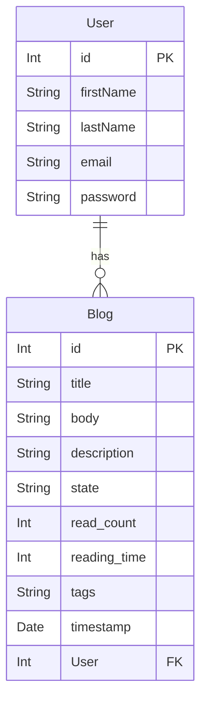

# Entity relationship diagram

[Official documentation](https://mermaid-js.github.io/mermaid/#/entityRelationshipDiagram) & [live editor](https://mermaid-js.github.io/mermaid-live-editor/edit#pako:eNp9kdFqwyAUhl9FznXTB8hdiTIC6xwmLRS8cXq6ypJYrCmMJO8-syVbs5V5p-f7zn_kdKCdQUgBPbXq1ataNuT7ZLui5FsmyNCv131HKHvM90wckg2lghUFSclJXe4afZ8kriNc0HhJyblSGv8l86c9zzMWWQmVVS8VkqPzEm6dP_m_UjxqtNdlztx3RPsfVLsr-gX4VbnFkrxk28jaRletWbZ9FpzusjLJNiV74OIwi9P7Z0ITlG3uWYu55xQJzhv0aGLe8tuEwApq9LWyJq6qG2sSwglrlDCKRvm3URki156NCsiMDc5DelTVBVeg2uCK90ZDGnyLMzRtfKKGDwePlnE).

